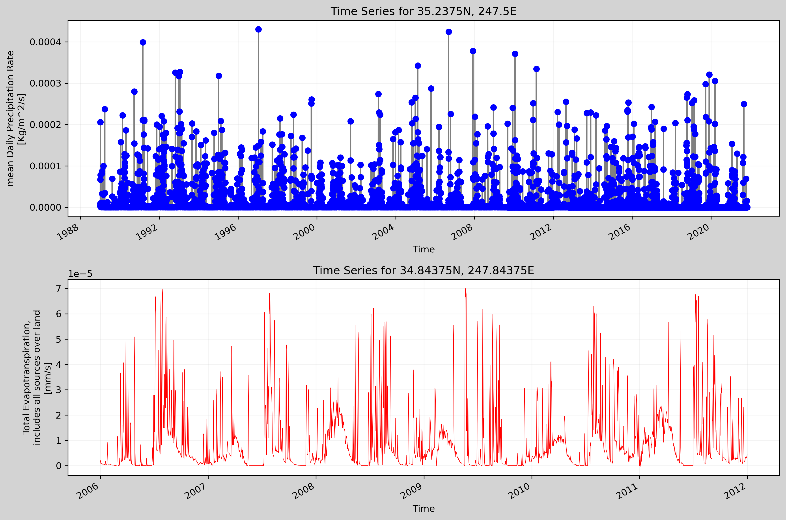

## Connal Boyd
## HW #11
## 11/08/2021

### 1.) A brief summary of how you chose to generate your forecast this week.

I used the weekly average flow from the last forecast period as well as the historical average flow for the 1 week and 2 week forecast periods. I also considered a November flow histogram as well. I brought in two datasets that included precipitation and evapotranspiration data in hopes that it would provide insight into the behavior of the larger stream system.

### 2.) A description of the dataset you added

### What is the dataset? Why did you choose it?

I added a dataset of precipitation data from the NCEP Reanalysis Daily Averages Dataset as well as evapotranspiration data from the Livneh Daily CONUS Near-surface Derived Hydrometeorological Dataset. I thought precipitation data would indicate responses in streamflow whereas evapotranspiration (ET) could indicate trends in flow decreases (especially when ET is high).

### What is the spatial and temporal resolution and extent of the data ?

The NCEP data runs from 1989-01-01 to 2021-11-01, and the Livneh Data runs from 2006-01-01 to 2011-12-31. Both datasets were limited to the same lat and lon extents during downloading, however the Livneh data contained higher resolution data than the NCEP data upon import into Python. The NCEP data only had two lat and two lon values whereas the Livneh data had 64 lat and 64 lon within the downloaded extent.

### What was your approach to extracting and aggregating it into something useful to you?

Each dataset only had one variable so I used the .values method to select the data I wanted. I chose corresponding lat/lon points between the precip and ET datasets so the two would spatially correlate better. I used the .sel method to select only data in the lat/lon pair I chose for each dataset. I then translated both datasets into pandas dataframes for ease of accessibility and comparison with the other analysis code I had previously written.

### A plot of the dataset you added. This can be a timeseries, map, histogram or any other plot that you think is a good summary of what you added.

  
