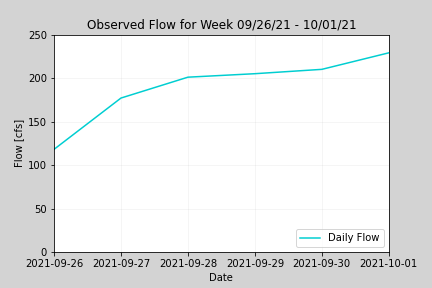
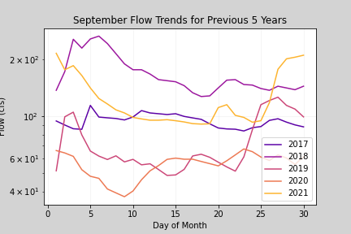
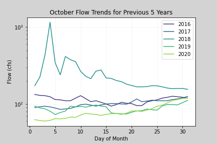
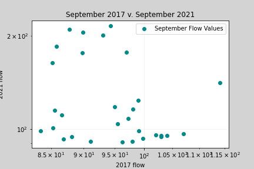
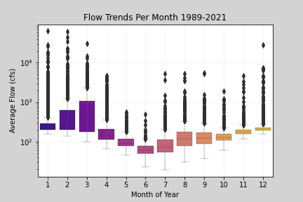
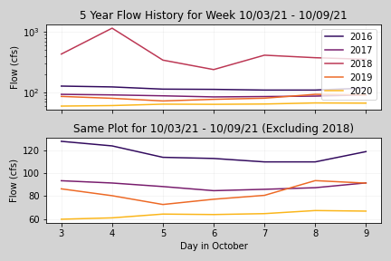
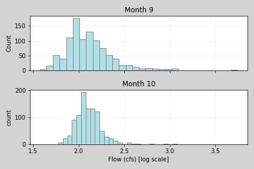

### Connal Boyd

#### HW #6
#### 10/03/21

____
## Grade
1/3: Great work I like your logic and what you did to mix up the plotting. However,non of your plots are coming through in the markdown. This is because its looking for your png files three directories up in an images folder. You whoudl copy your images folder into your forecast submissions folder and then change the path here. If you need help ask me after class and you can resubmit once its fixed. 

Revised Grade 3/3: Plots fixed
____
1 Week: 180 cfs, 
2 Week: 174 cfs

Last week's flow showed an increase in the flow as the week went on, as seen below.

  

I used data from the whole dataset to create this plot, but set limits along the x axis to only capture the window of time I wanted to look at.
I wanted to see what kind of trend last week's flow would follow.
I then looked at what the previous five years' trends looked like for flows in September and October as seen below.

  
  

These showed that this year's September flow pretty closely followed the 2017 flow for much of the middle of the month, 
but the ends of the month had much higher flow trends.
Flow has been higher over the last couple of weeks than for the same time period in the last five years.
October flows generally fall along the same trajectory of flows in the 100s cfs.
I used the same for loop structure to create both of these graphs. This helped to pull data iteratively from each year I wanted to graph instead of trying to graph each year individually.
I then used a scatter plot to see if there was any correlation between September 2017 and September 2021 flow values. I had hoped this would narrow my prediction values for the next couple of weeks. However, if the two datasets were more strongly correlated then they would follow a more strongly 1:1 linear path. This is missing in the plot so this graph was not very helpful in the end.

  
  
Next I used a boxplot to determine how much error there is around September and October average flow values.
This plot shows that October has a much smaller spread than September, but both are pretty good in terms of accuracy around the mean value.
This indicates that as the months go on, our predictions could trend closer and closer toward the historical averages since there is less error around those values in the dataset near the end of the year (see below).

  
 
The historical values for the last 5 years for this week's forecast window shows that the flow was generally between 60 and 130 cfs (excluding 2018 flows). 
Flow in 2018 was much higher than any of the other years, and this made the first graph more difficult to read.

  
 
Since flow was much higher last week than expected, I generated a histogram plot to compare September flows to October flows for the whole dataset.
Overall, flows most often occur in September at a little less than 200 cfs.
In October this number is slightly higher than 200 cfs, likely around 215 cfs or so.

  
 
As a result of the information that all of these graphs show me, I predicted that the 1 week flow will be 180 cfs. This is slightly lower than the whole month's average of 200 some cfs. I also predicted a lower 2 week prediction of 174 cfs since I wanted to be conservative in my estimation.