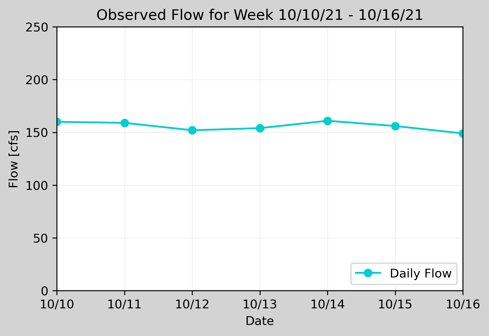
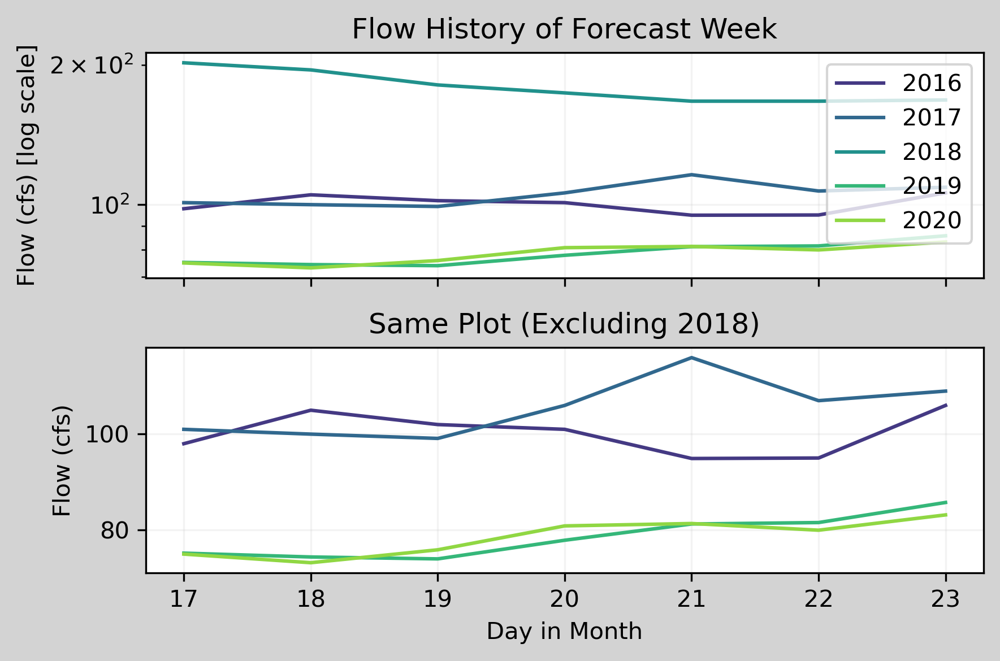
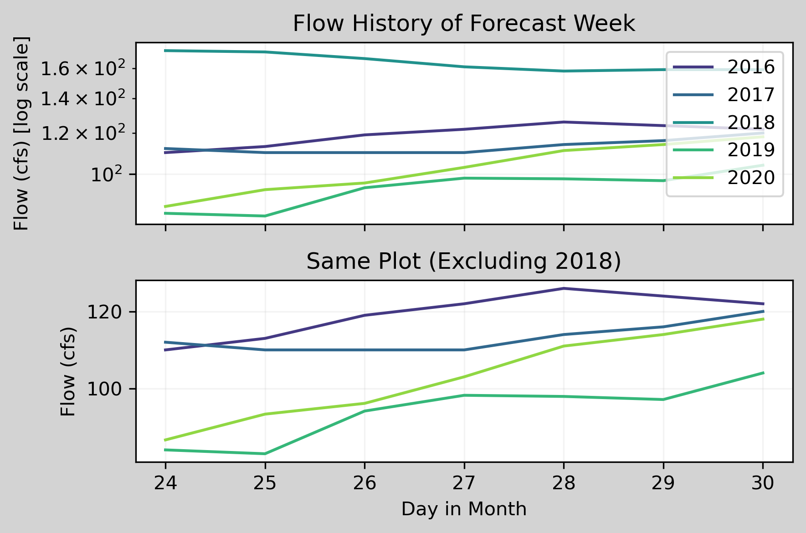
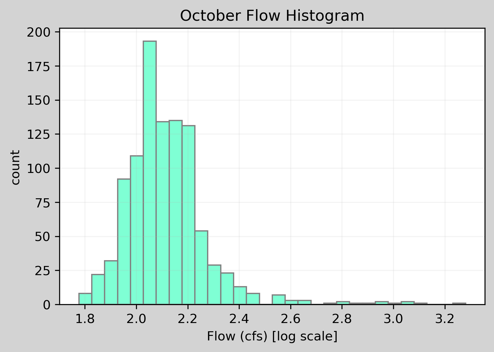

### Connal Boyd
##### HW #8
###### 10/18/21

###### 1.) An explanation of how you generated your forecasts and why?

I chose to set my forecast values at 148 for my 1 week prediction and 150 for my 2 week prediction. This resulted largely from my analysis of the plots generated by my code, as well as input from summary statistics for October flows and last week's mean flow value. Last week had a mean flow value of about 156 cfs which is very close to the 75th percentile of October flows (154 cfs). The 5 year history for the next two forecast periods show increases in flow over the week, but on average present lower flows than we are currently seeing. I estimate the flow will decrease somewhat from the flow average we saw last week since we are headed toward winter, but will be counteracted slightly by the historical trend toward flow increase. This could result in an evening out of the flow over the week, like we saw last week with no strong trend upward or downward in flow. When looking at the histogram, we still have most flows over 200 cfs, so it is possible we will see greater flows still to come this month.

###### 2.) The three graphs you are including with an explanation of why you chose these three graphs.

The summary graph of the previous week's flow helped me to form an adequate understanding of current streamflow conditions. This created a baseline for my predictions for the next two week's forecasts.

At this point, I wanted to know what the history of the next two forecast periods would look like. I chose 5 years since this would provide anomalous data, due to the extreme drought in 2020, as well as regular data. This time frame is also more readable than 10 or 20 years of data.

I chose to plot a histogram of all October flows in the dataset as well. If used correctly, this plot can provide useful information about the most common flow values in October, which helps create a more accurate forecast range. However, I think there may be issues with the construction of this graph. The scale on its x-axis does not look quite right to me, and from what I know of histograms I would expect the peak of the histogram to correspond to the mean October flow value (144 cfs). This is likely due to an issue with the coding of the x labels.

  

###### 3.) A brief summary of what you got out of the peer evaluation. How did you make your script better based on the feedback you received?

Overall, I found the code review very helpful. I would have liked a bit more specific feedback, but considering the issues my partner had with running my code I understand that they could only provide feedback to a limited extent. I received good feedback on making some of my comments more descriptive as well as making some of my instructions clearer on what my functions produce. I also tightened up my PEP8 style to be more consistent. Additionally, I added to my docstrings within my function description and condensed some of my redundant code sections.

###### 4.) A summary of how you are using timeseries functionality in your script.

While setting up my pandas dataframe, I use the parse_dates and index_col parameters to set the 'datetime' column first as a datetime object and then as my dataframe index. This simplified my code and made it much easier to access dates in the dataframe later in my code. I named my dataframe 'data' and used variations on data.index to access different parts of dates for many sections of my code. For example, using data[(data.index.month == 10)]['flow'].describe() I was able to find summary statistics for all of the October flow values in my dataframe. I also used this data.index."date" method in my for loops and plots. I applied the DateFormatter method to format the x-axis for one of my plots as well.

###### 5.) Describe the part of your script that you are most proud of and why.

I am most proud of my function. In addition to including all of the pieces it should, docstrings, parameters, returns, etc., the function is set up to return the fig variable. As long as users set the function equal to fig when running it, this will give users more flexibility to customize the generated figure individually after running the function.
