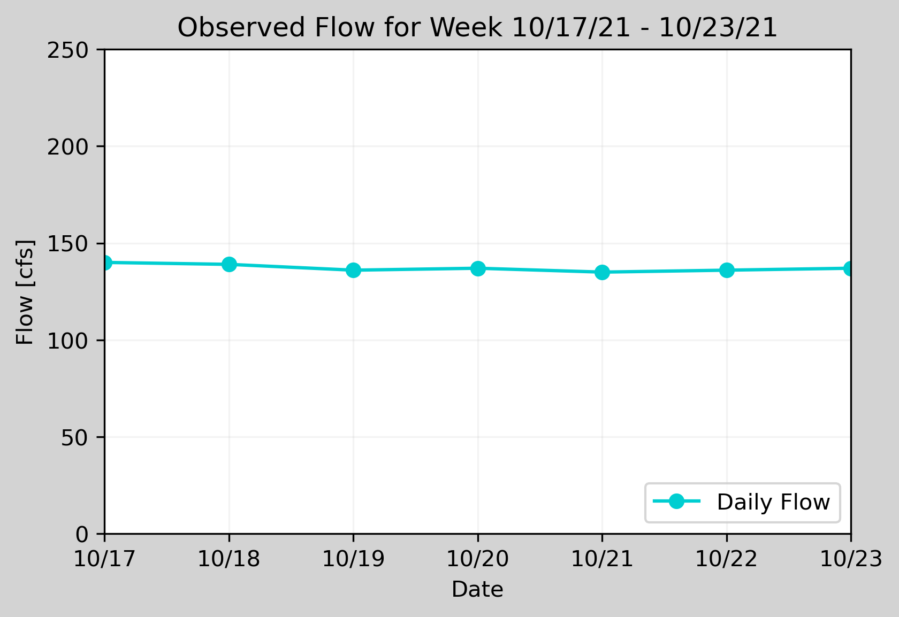

### Connal Boyd
#### HW #9
#### 10/25/21

1.) A brief summary of the how you chose to generate your forecast this week.

I selected values similar to last week's flow due to the flattening out of the streamflow seen throughout last week's forecast period. I used the forecast plot and mean value of each day for last week's forecast period.

2.) A description of the dataset you added
        What is the dataset? Why did you choose it?
        What location have you chosen?
        Where did you get the data from?
        What was your approach to accessing it?

I tried to access data from the Verde River near Clarkdale, both from the USGS (https://waterdata.usgs.gov/nwis/uv/?site_no=09504000&PARAmeter_cd=00045) and from Mesonet (https://explore.synopticdata.com/VDCA3/metadata). However, I could not get my APIs to work properly for the USGS data and the Mesonet data would not show any precipitation data it would only show the time data. I could not figure out what was going on with my APIs. I could not determine why I could not connect to the USGS data properly or where the precipitation data was hiding in the dictionaries for the Mesonet data. I will need some additional help to figure this out.

3.) Plot of your additional time series along with your streamflow time series.

I could not get my time series from the API to work so I do not have a plot to include.

4.) A plot that illustrates how you chose your forecast values.

  
