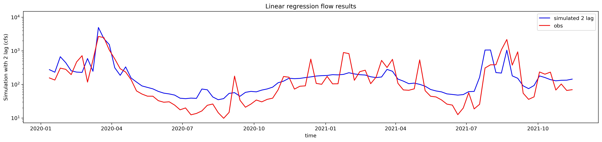

# Week 12 - Team forecast
## Group 2 - Connal Boyd, Andrew Hoopes, Steph Serrano, Zhang Xingyu

<<<<<<< HEAD

1 Wk Forecast:156.1

2 Wk Forecast:134.9
=======
1) Week Forecast: **156.1**
>>>>>>> master

2) Week Forecast: **134.9**

<<<<<<< HEAD

4.) A summary of your forecast. This should be written as a narrative summary without any blocks of code. It should summarize the inputs and approach used and must include at least 1 map and 1 graph. Only include graphs that you talk about in your narrative.

1. data: 
1.1the streamflow data before 2021 Nov 11, downloaded from the USGS web.
1.2the precipitaion rate data in 1989 Jan 1st to 2021 Nov 11th, downloaded from the PSl web, averaged by time.
1.3 the air temperature data in 1989 Jan 1st to 2021 Nov 11th, downloaded from the PSl web, averaged by time.
(1.1 downloaded by Connal, 1.2 and 1.3 data downloaded by Xingyu)

2. Correct the data: becuase the flow data has a great peak in 2005, we cannot use a long time series. Because the linear regression algorithm may be overfitted if the sample time is too lang, I droped the time before 2020. Although the latitude and longitude of precipitation and air temperatrue are different, we can make an average of the whole region(33-37N,246-250E). After that, I merge the streamflow data, precipitation data and the air temperature data into one dataframe. The precipitaiton and air temperature data should be normalinzed(minus mean and devided by std). 

3. Calculate the forecast: resample the data into weekly. the use the precipitation, air temperature and last week flow to train the model. The coefficient of determination is 0.64, so that this model fitted well. In this way, the forecast = 156.1 and 134.9, respectively.

4. plot[]
    

6.  map[]

=======
3) A brief summary of your collaboration. What did each team member bring to the table, who did what and how did you decide how to combine things?
  - Andrew:
    - Coded the USGS daily streamflow values into the code while adding time-series plots and aiding in creating a map
  - Connal
    - Aided in the creation of the map and time-series plots while cleaning the code and adjusting file paths..
  - Xingyu
    - 
    - Download reanalysis data. Merge the data into one dataframe and normalize it. Calculate the forecast.Draw Linear regression plots. Write part of the Readme file.  

  - Steph
    - Added a logarithmic function that showed daily flow values for the month of November for a given year.

4) A summary of your forecast. This should be written as a narrative summary without any blocks of code. It should summarize the inputs and approach used and must include at least 1 map and 1 graph. Only include graphs that you talk about in your narrative.
  - The USGS daily streamflow data values were coded into a Pandas Dataframe using a URL link where they were then resampled to extract only the November flow. The November flow averages for each year in the dataset were then plotted to see if there were any outliers within the data. The plot showed that the flow values before 2005 were extremely high in comparison to the rest of the values. The flow data was then modified to reflect values after 2005. Hierarchical data was then added to provide outside data that could potentially affect the streamflow values. The precipitation rates and air temperature near the Verde River Watershed were extracted from NetCDF files  using the NOAA PSL website and plotted on graphs. A plot of the streamflow during the previous forecast period (November 7th, 2021 to November 13th, 2021) was also added to see what current trend is occurring at the streamgage. A map of the state of Arizona was also added to the code. This map plotted the state of Arizona, the Verde River/Salt River Boundaries, and important points in the state. Finally, a logarithmic plot of the daily flow values for the month of November for whatever year was desired to be viewed was added in.
>>>>>>> master
